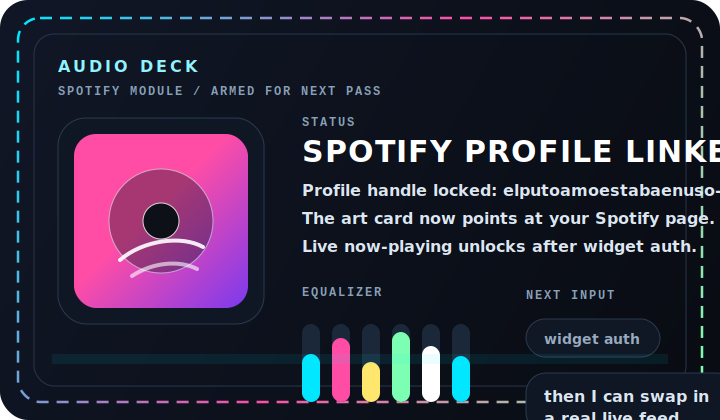

<!-- PROFILE README v1 // cyberpop control room -->

<div align="center">
  
</div>

<div align="center">
  
</div>

<div align="center">
  <a href="#live-telemetry"></a>
  <a href="#audio-deck"></a>
  <a href="#hidden-panels"></a>
  <a href="https://github.com/yeaight7?tab=repositories"></a>
</div>

<div align="center">
  
  
  
</div>

## Mission Control

```bash
> whoami
yeaight7

> mode
overclocked profile README / live widgets / expandable panels

> design_brief
make it loud, animated, and impossible to scroll past
```

I like profile READMEs that feel more like a launch screen than a business card.  
This first pass leans into neon telemetry, animated SVG art, live GitHub widgets, and clickable panels that make the page feel a little more playable.

<table>
  <tr>
    <td width="58%" valign="top">
      <h3>Signal</h3>
      <p>Built to look intentional, not template-generated.</p>
      <p>Heavy contrast, live stats, modular sections, and enough motion to feel alive without turning into a mess.</p>
      <h3>Quick Launch</h3>
      <p>
        <a href="https://github.com/yeaight7?tab=repositories"></a>
        <a href="https://github.com/yeaight7?tab=stars"></a>
        <a href="https://github.com/yeaight7?tab=followers"></a>
      </p>
      <h3>Vibe</h3>
      <p>Bright UI, dark backdrop, control-room framing, and a little bit of arcade chaos.</p>
    </td>
    <td width="42%" valign="top">
      <a href="https://open.spotify.com/user/elputoamoestabaenuso-4?si=8047bbb57cde4317">
        
      </a>
    </td>
  </tr>
</table>

## Live Telemetry

<div align="center">
  
  
</div>

<div align="center">
  
  
</div>

<div align="center">
  
</div>

## Audio Deck

<div align="center">
  <a href="https://open.spotify.com/user/elputoamoestabaenuso-4?si=8047bbb57cde4317"></a>
  <a href="https://spotify-github-profile.kittinanx.com/api/login"></a>
</div>

The Spotify profile link is wired now.  
A real now-playing card needs an authenticated backend, and the public widget endpoint for `elputoamoestabaenuso-4` currently returns an invalid token error until that service is connected to your Spotify account.

## Hidden Panels

<details>
  <summary><b>OPEN // loadout.cfg</b></summary>
  <br/>

  <div align="center">
    
    
    
    
  </div>

  ```txt
  aesthetic      : cyberpop / arcade / HUD
  structure      : hero -> telemetry -> audio deck -> expandable vault
  intent         : memorable first impression
  next upgrades  : repo spotlights, personalized socials, authenticated Spotify live feed
  ```
</details>

<details>
  <summary><b>OPEN // sidequest.log</b></summary>
  <br/>

  - Add a featured-project strip with custom cards for your best repos.
  - Wire in socials, portfolio links, or a contact panel if you want the README to convert visitors.
  - Push the visuals even harder with repo-specific artwork if you want a full anime, cyberpunk, retro, or luxury direction.
</details>

<details>
  <summary><b>OPEN // boss_fight_mode</b></summary>
  <br/>

  If you want the next version to go further, I can take this in one of these directions:

  - full anime trading-card layout
  - retro handheld console UI
  - brutalist poster wall
  - luxury black-and-gold dashboard
  - glitchy terminal bunker
</details>

<div align="center">
  <sub>Built for impact first. Next pass can lock the theme even harder and wire in any extra links or showcase projects you want exposed.</sub>
</div>
