<!-- PROFILE README v2 // cyberpunk signal board -->

<div align="center">
  
</div>

<div align="center">
  
</div>

<div align="center">
  <a href="#spotify-signal"></a>
  <a href="#live-telemetry"></a>
  <a href="#identity-matrix"></a>
  <a href="#featured-artifact"></a>
</div>

<div align="center">
  
  
  
</div>

## Mission Control

```bash
> whoami
yeaight7

> mode
overclocked builder

> directive
search, destroy, build
```

Signal up front. Telemetry in the middle. One real artifact below.

## Spotify Signal

<table>
  <tr>
    <td width="50%" valign="top">
      <div align="center"></div>
      <a href="https://spotify-github-profile.kittinanx.com/api/view?uid=elputoamoestabaenuso-4&redirect=true">
        
      </a>
    </td>
    <td width="50%" valign="top">
      <div align="center"></div>
      <a href="https://open.spotify.com/user/elputoamoestabaenuso-4?si=fc3fc600be024a5c">
        
      </a>
    </td>
  </tr>
</table>

## Live Telemetry

<table>
  <tr>
    <td width="50%" align="center">
      
    </td>
    <td width="50%" align="center">
      
    </td>
  </tr>
  <tr>
    <td width="50%" align="center">
      
    </td>
    <td width="50%" align="center">
      
    </td>
  </tr>
</table>

<div align="center">
  
</div>

## Identity Matrix

I build interfaces that hit first and make sense second by second.<br/>
Precision matters, but so does presence.<br/>
If a page looks safe, it is not finished.<br/>
The whole point is controlled impact.

<div align="center">
  <a href="https://github.com/yeaight7?tab=repositories"></a>
  <a href="https://open.spotify.com/user/elputoamoestabaenuso-4?si=fc3fc600be024a5c"></a>
  <a href="https://github.com/yeaight7?tab=followers"></a>
</div>

## Featured Artifact

<div align="center">
  <a href="https://github.com/yeaight7/Simulacion-de-Materiales">
    
  </a>
</div>

`Simulacion-de-Materiales` is the current public artifact on deck: a MATLAB-based simulation project with rigid and biarticulated node variants, a full write-up in LaTeX and PDF, and structure imagery baked into the repo.
