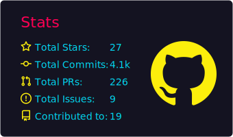
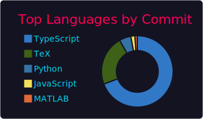
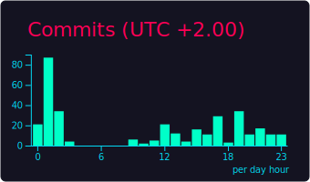
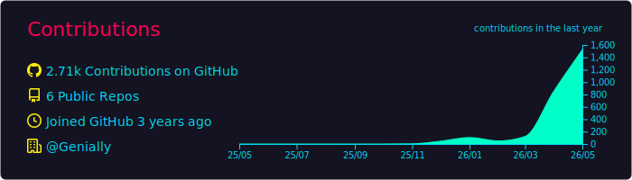
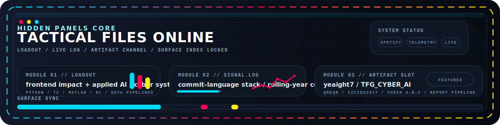
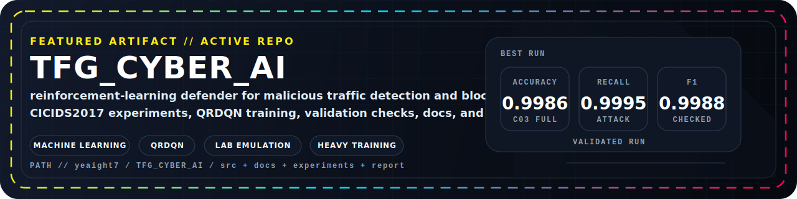

<!-- PROFILE README v3 // hybrid signal board -->
<!-- README_REFRESH: 24282067107-1-0198e0932eaa963ec3386aa776649aba1983f8b5 -->

<div align="center">
  
</div>

<div align="center">
  
</div>

<div align="center">
  <a href="#spotify-signal"></a>
  <a href="#live-telemetry"></a>
  <a href="#featured-artifact"></a>
</div>

<div align="center">
  
  <!-- 
   -->
</div>

## Mission Control

```bash
> whoami
yeaight7

> mode
overclocked builder

> directive
search, destroy, build
```

## Spotify Signal

<div align="center">
  <a href="https://spotify-github-profile.kittinanx.com/api/view?uid=elputoamoestabaenuso-4&redirect=true">
    
  </a>
</div>

## Live Telemetry

<div align="center">
  <table width="100%">
    <tr>
      <td width="50%" align="center">
        
      </td>
      <td width="50%" align="center">
        
      </td>
    </tr>
    <tr>
      <td width="50%" align="center">
        
      </td>
      <td width="50%" align="center">
        
      </td>
    </tr>
    <tr>
      <td colspan="2" align="center">
        
      </td>
    </tr>
  </table>
</div>

## Hidden Panels

<div align="center">
  
</div>

<details>
  <summary><b>OPEN // loadout.cfg</b></summary>
  <br/>

```txt
  primary lane : ML + applied AI / cybersecurity systems
  stack        : Machine Learning / SQL / Data Engineering / RL / data-heavy workflows
  build rule   : make it hit first, then make it hold up under scrutiny
```

<div align="center">
    <a href="https://github.com/yeaight7?tab=repositories"></a>
    <a href="https://www.linkedin.com/in/javier-rivero-iglesias"></a>
  </div>
</details>

<details>
  <summary><b>OPEN // signal.log</b></summary>
  <br/>

```txt
  [live] streak board is live. Last update: Today
  [ok] language stack reports the percentage of languages used across all commits
  [ok] contribution panel is the exact rolling last-12-month view
  [live] featured repo is TFG_CYBER_AI
```

<div align="center">
    <a href="https://github.com/yeaight7?tab=stars"></a>
    <a href="https://github.com/yeaight7?tab=followers"></a>
    <a href="https://github.com/yeaight7/actions"></a>
  </div>
</details>

<details>
  <summary><b>OPEN // artifact-slot</b></summary>
  <br/>

<div align="center">
    <a href="https://github.com/yeaight7/TFG_CYBER_AI">
      
    </a>
  </div>

```txt
  repo         : TFG_CYBER_AI
  focus        : reinforcement-learning defender for malicious traffic detection and blocking
  core data    : CICIDS2017 (~2.8M flows)
  best run     : 0.9986 accuracy / 0.9995 attack recall / 0.9988 F1
  shape        : code + datasets + docs + experiments + full report pipeline
```

</details>

## Featured Artifact

<div align="center">
  <a href="https://github.com/yeaight7/TFG_CYBER_AI">
    
  </a>
</div>

<div align="center">
  <a href="https://github.com/yeaight7/TFG_CYBER_AI"></a>
  
  
</div>

`TFG_CYBER_AI` is a reinforcement-learning cyber defense project built around CICIDS2017, a custom Gymnasium defender environment, QRDQN training, validation checks, and a full paper/report pipeline. [WIP]
