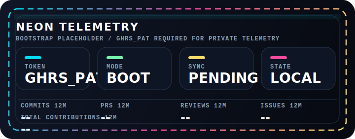
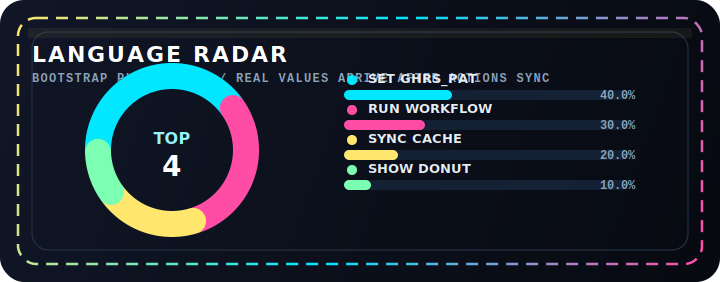
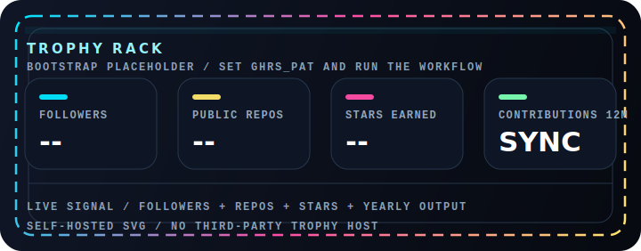

<!-- PROFILE README v3 // hybrid signal board -->

<div align="center">
  
</div>

<div align="center">
  
</div>

<div align="center">
  <a href="#spotify-signal"></a>
  <a href="#live-telemetry"></a>
  <a href="#hidden-panels"></a>
  <a href="#featured-artifact"></a>
</div>

<div align="center">
  
  
  
</div>

## Mission Control

```bash
> whoami
yeaight7

> mode
overclocked builder

> directive
search, destroy, build
```

Cyberpunk shell up front. Live music on the flank. Local telemetry wired into the core.

## Spotify Signal

<table>
  <tr>
    <td width="50%" align="center">
      <div align="center"></div>
      <a href="https://spotify-github-profile.kittinanx.com/api/view?uid=elputoamoestabaenuso-4&redirect=true">
        
      </a>
    </td>
    <td width="50%" align="center">
      <div align="center"></div>
      <a href="https://open.spotify.com/user/elputoamoestabaenuso-4?si=fc3fc600be024a5c">
        
      </a>
    </td>
  </tr>
</table>

## Live Telemetry

<table>
  <tr>
    <td width="50%" align="center">
      
    </td>
    <td width="50%" align="center">
      
    </td>
  </tr>
  <tr>
    <td width="50%" align="center">
      
    </td>
    <td width="50%" align="center">
      
    </td>
  </tr>
</table>

<div align="center">
  
</div>

## Hidden Panels

<div align="center">
  
</div>

<details>
  <summary><b>OPEN // loadout.cfg</b></summary>
  <br/>

  ```txt
  archetype    : signal-first builder
  taste        : cyberpunk HUDs / hard contrast / deliberate impact
  specialty    : loud interfaces, sharp systems, clean execution
  current      : turning a profile page into a control surface
  ```

  <div align="center">
    <a href="https://github.com/yeaight7?tab=repositories"></a>
    <a href="https://open.spotify.com/user/elputoamoestabaenuso-4?si=fc3fc600be024a5c"></a>
    <a href="https://www.linkedin.com/in/javier-rivero-iglesias"></a>
  </div>
</details>

<details>
  <summary><b>OPEN // signal.log</b></summary>
  <br/>

  ```txt
  [ok] spotify now-playing is still live on the left flank
  [ok] local telemetry paths are wired into /assets/generated
  [wait] GHRS_PAT must exist before the workflow can sync private stats
  [open] featured artifact slot is intentionally left hot-swappable
  ```

  <div align="center">
    <a href="https://github.com/yeaight7?tab=stars"></a>
    <a href="https://github.com/yeaight7?tab=followers"></a>
    <a href="https://github.com/yeaight7/actions"></a>
  </div>
</details>

<details>
  <summary><b>OPEN // artifact-slot</b></summary>
  <br/>

  <div align="center">
    <a href="https://github.com/yeaight7?tab=repositories">
      
    </a>
  </div>

  This slot is a live placeholder.  
  Drop your next public repo here by swapping the link, title, and card asset when the real project is ready.
</details>

## Featured Artifact

<div align="center">
  <a href="https://github.com/yeaight7/Simulacion-de-Materiales">
    
  </a>
</div>

Swap the link and the label when the real public repo is ready to take the slot.
